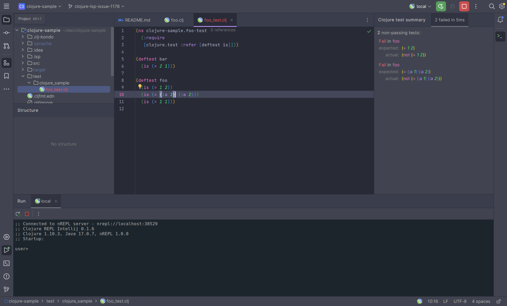

# clojure-repl-intellij

<!-- Plugin description -->

Free OpenSource IntelliJ plugin for Clojure REPL development. 

Checkout all available [features](https://github.com/afucher/clojure-repl-intellij#features)

<!-- Plugin description end -->

---
## Getting Started
After installing [the plugin](https://plugins.jetbrains.com/plugin/23073-clojure-repl) in IntelliJ, you can add a REPL to your Run
configurations.

### Local: Start a nREPL server from IntelliJ
1. Go to `Run` > `Edit Configurations`
2. If you don't have any existing configurations, click `Add new...` or `Add new run configuration`. Otherwise, click the `+` ("Add New Configuration").
3. Select `Clojure REPL` > `Local`
4. Optional: Name your Configuration (e.g. "Local REPL")
5. Click `OK`

### Remote: Connecting to an existing nREPL process
1. Ensure you have an existing nREPL process running outside IntelliJ
2. Within Intellij, go to `Run` > `Edit Configurations`
3. If you don't have any existing configurations, click `Add new...` or `Add new run configuration`. Otherwise, click the `+` ("Add New Configuration").
4. Select `Clojure REPL` > `Remote`
5. In the boxes for `Host` and `Port` copy and paste the values from your existing nREPL process
6. Optional: Name your Configuration (e.g. "Remote REPL")
7. Click `OK`

## Features

- Start a nREPL server from IntelliJ
- Connect to an existing nREPL process
- Load file to REPL (`alt/opt + shift + L`)
- Eval code at point (`alt/opt + shift + E`)
- Eval defun at point (`alt/opt + shift + D`)
- Run ns tests  (`alt/opt + shift + T` `alt/opt + shift + N`)
- Run test at cursor (`alt/opt + shift + T` `alt/opt + shift + T`)
- Re-run last test  (`alt/opt + shift + T` `alt/opt + shift + A`)
- Switch to file namespace (`alt/opt + shift + N`)
- Clear REPL output (`alt/opt + shift + R` `alt/opt + shift + C`)
- Refresh all ns (`alt/opt + shift + R` `alt/opt + shift + A`)
- Refresh changed ns (`alt/opt + shift + R` `alt/opt + shift + R`)
- Entry history navigation in REPL (`ctrl + PAGE_UP` or `ctrl + PAGE_DOWN`)

### Soon

- Customize REPL UI

## Contributing

Contributions are very welcome, check the [issues page](https://github.com/afucher/clojure-repl-intellij/issues) for more information about what are good first issues or open an issue describing the desired support.

## Developing
install babashka from https://github.com/babashka/babashka#installation

`bb run-ide` to spawn a new IntelliJ session with the plugin.

or

`bb build-plugin` to build the plugin, then install it from disk in IntelliJ, the zip should be on `./build/distributions/*.zip`.

## Release

1. `bb tag x.y.z` to tag and push the new tag
2. `bb publish-plugin` to publish to Jetbrains Marketplace (requires JETBRAINS_TOKEN on env).
