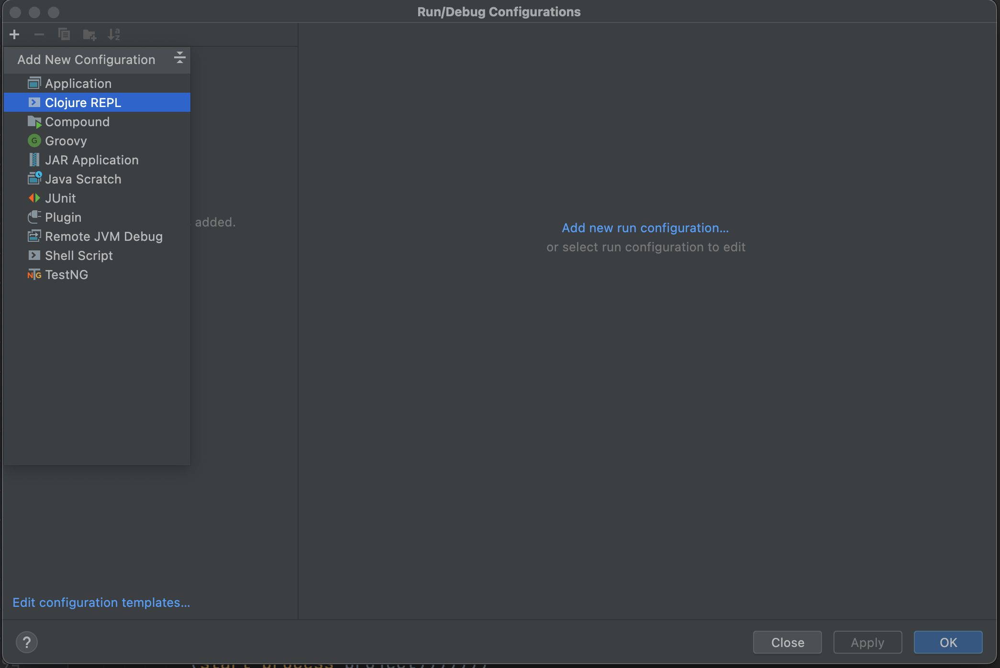
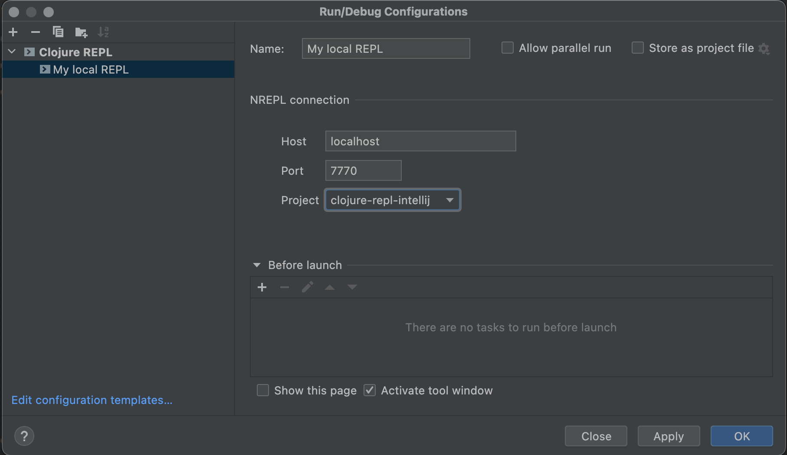
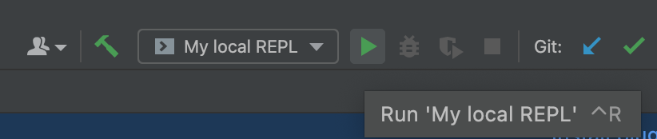

# How to use

## Configuration

Create a new Run Configuration of type `Clojure REPL`

Fill in the host and port of your REPL server. The default values are `localhost` and `7770`.
Also, check if the selected project is the one you want to use.

## Running

Run the configuration you just created. 

A new REPL window should appear, and you should be able to evaluate code in it.  

